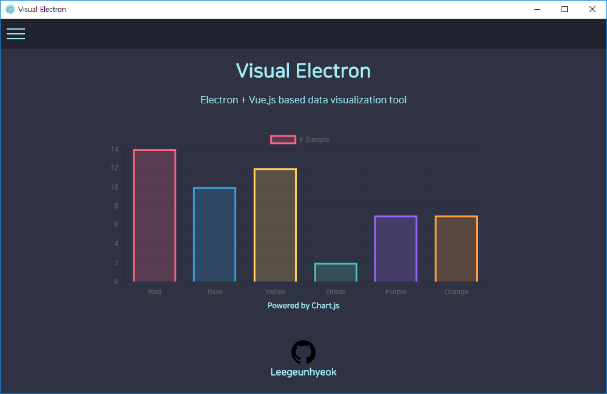

<div align="center">
  

  [](https://postimg.cc/image/k33uxu7cd/)
  
  [](https://github.com/standard/standard)

  [ENGLISH](https://github.com/leegeunhyeok/visual-electron/blob/master/README.md)
  /
  [한국어](https://github.com/leegeunhyeok/visual-electron/blob/master/README_KR.md)

</div>

# Visual Electron
[Electron](https://electronjs.org/) + [Vue.js](https://vuejs.org/) based data visualization tool

# Setup
Install dependencies modules and execute `dev` mode
```bash
yarn # or (npm install)
yarn run dev # or (npm run dev)
```

# Information
- Developer: Leegeunhyeok(lghlove0509@naver.com)
- Developing..
<div align="center">
  
</div>
